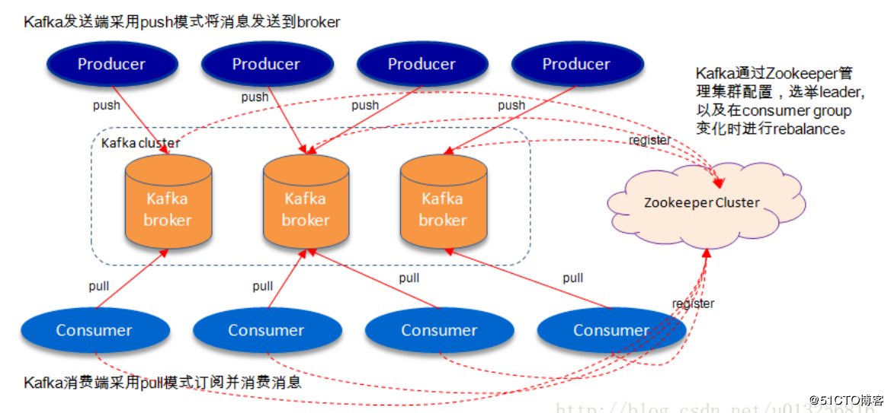

<meta name="referrer" content="no-referrer" />


<!-- more -->

### 一、KAFKA



#### 1、特性

- 持久性：文件性存储，日志文件存储消息，达到阈值写磁盘，减少磁盘i/o，如果宕机会丢数据
- 高吞吐：普通机器百万qps
- 支持通过kafka服务器和消费机集群分区消息？
- 支持hadoop并行数据加载

#### 2、术语

- Broker：消息中间处理节点，kafka节点=broker，一个或多个broker组成kafka集群
- Topic：kafka根据topic归类消息
- Producer：生产者
- Consumer：消费者
- ConsumerGroup：消费组
- Partition：物理概念，一个topic分多个partition，partition内部有序

#### 3、其他

​	partition存储层面是append log文件，追加log文件尾部，offset标记消息在文件位置，offset是long数字，顺序写磁盘效率高于随机写内存，保证高吞吐

#### 4、部署

```shell
[root@kafka ~]# wget https://archive.apache.org/dist/kafka/2.2.1/kafka_2.11-2.2.1.tgz
[root@kafka ~]# tar zxf kafka_2.11-2.2.1.tgz 
[root@kafka ~]# mv kafka_2.11-2.2.1/ /usr/local/kafka
[root@kafka ~]# cd /usr/local/kafka/bin/
#启动zookeeper
[root@kafka bin]# ./zookeeper-server-start.sh ../config/zookeeper.properties &
#启动kafka
[root@kafka bin]# ./kafka-server-start.sh ../config/server.properties &
#查看端口是否在监听
[root@kafka bin]# netstat -anput | grep 9092
tcp6       0      0 :::9092                 :::*                    LISTEN      43326/java          
tcp6       0      0 192.168.171.134:44388   192.168.171.134:9092    ESTABLISHED 43326/java          
tcp6       0      0 192.168.171.134:9092    192.168.171.134:44388   ESTABLISHED 43326/java   
#在本机创建kafka，副本数量为1，分区数量为1
[root@kafka bin]# ./kafka-topics.sh --create --bootstrap-server localhost:9092 --replication-factor 1 --partitions 1 --topic test
#查看本机的topic
[root@kafka bin]# ./kafka-topics.sh --list --bootstrap-server localhost:9092
test
#发送消息到test
[root@kafka bin]# ./kafka-console-producer.sh --broker-list localhost:9092 --topic test
>aaa
>bbb
>ccc
#开启新的终端，进行读取消息测试，“--from-beginning”表示从开头读取
[root@kafka bin]# ./kafka-console-consumer.sh --bootstrap-server localhost:9092 --topic test --from-beginning
aaa
bbb
ccc
```

[kafka单机部署](https://cloud.tencent.com/developer/article/1624740)

### 二、FLINK

```shell
# https://flink.apache.org/zh/downloads.html
# scala2.12 flink-1.7.1
tar zxvf flink-1.7.1-bin-scala_2.12.tgz
# scala 2.11 flink-1.8.0
# flink --version
cd flink-1.7.1
./bin/start-cluster.sh
# http://9.134.196.182:8081
wget https://streaming-with-flink.github.io/examples/download/examples-scala.jar
./bin/flink run -c io.github.streamingwithflink.chapter1.AverageSensorReadings examples-scala.jar
./log 日志
web ui cancel取消任务
./bin/stop-cluster.sh 


# 依赖
<dependency>
  <groupId>org.apache.flink</groupId>
  <artifactId>flink-java</artifactId>
  <version>1.14.3</version>
</dependency>
<dependency>
  <groupId>org.apache.flink</groupId>
  <artifactId>flink-streaming-java_2.11</artifactId>
  <version>1.14.3</version>
</dependency>
<dependency>
  <groupId>org.apache.flink</groupId>
  <artifactId>flink-clients_2.11</artifactId>
  <version>1.14.3</version>
</dependency>
Scala API: 为了使用 Scala API，将 flink-java 的 artifact id 替换为 flink-scala_2.11，同时将 flink-streaming-java_2.11 替换为 flink-streaming-scala_2.11。
```

[官网](https://flink.apache.org/)

### 三、HADOOP

```shell
# cat /etc/profile
# export JAVA_HOME=/usr/java/jdk1.8.0_231
# export HADOOP_HOME=/usr/local/hadoop/hadoop-2.7.3 # 需要重启命令行才生效
[root@VM-196-182-centos /usr/local]# java -version
openjdk version "1.8.0_71"
OpenJDK Runtime Environment (build 1.8.0_71-b15)
OpenJDK 64-Bit Server VM (build 25.71-b15, mixed mode)
[root@VM-196-182-centos /usr/local]# scala -version
Scala code runner version 2.11.8 -- Copyright 2002-2016, LAMP/EPFL
[root@VM-196-182-centos /usr/local]# hadoop version
# hadoop-2.7.3.tar.gz
# https://archive.apache.org/dist/hadoop/common/
wget https://archive.apache.org/dist/hadoop/common/hadoop-2.7.3/hadoop-2.7.3.tar.gz
tar zxvf hadoop-2.7.3.tar.gz 
mkdir -p /usr/local/hadoop/tmp/ # 指定hadoop运行时产生文件的存储路径 
mkdir -p /usr/local/hadoop/hdfs/  
mkdir -p /usr/local/hadoop/hdfs/data/ # datanode上数据块的物理存储位置
mkdir -p /usr/local//hadoop/hdfs/name/ # namenode上存储hdfs名字空间元数据
mv hadoop-2.7.3 /usr/local/hadoop
vim /usr/local/hadoop/hadoop-2.7.3/etc/hadoop/hadoop-env.sh
export JAVA_HOME=/usr/lib/jvm/java-1.8.0-openjdk-1.8.0.71-2.b15.el7_2.x86_64 # JAVA_HOME环境变量在这不生效 这里要显示声明一次
vim /usr/local/hadoop/hadoop-2.7.3/etc/hadoop/core-site.xml
<configuration>
    <!-- 指定HDFS老大（namenode）的通信地址 -->
    <property>
        <name>fs.defaultFS</name>
        <value>hdfs://9.134.196.182:9000</value>
    </property>
    <!-- 指定hadoop运行时产生文件的存储路径 -->
    <property>
        <name>hadoop.tmp.dir</name>
        <value>/usr/local/hadoop/tmp</value>
    </property>
</configuration>
vim /usr/local/hadoop/hadoop-2.7.3/etc/hadoop/hdfs-site.xml
<configuration>
    <property>
        <name>dfs.name.dir</name>
        <value>/usr/local/hadoop/hdfs/name</value>
        <description>namenode上存储hdfs名字空间元数据 </description> 
    </property>
    <property>
        <name>dfs.data.dir</name>
        <value>/usr/local/hadoop/hdfs/data</value>
        <description>datanode上数据块的物理存储位置</description>
    </property>
    <!-- 设置hdfs副本数量 -->
    <property>
        <name>dfs.replication</name>
        <value>1</value>
    </property>
</configuration>
# 配置yarn（非必需）
mv mapred-site.xml.template mapred-site.xml
vim mapred-site.xml
<configuration>
    <!-- 通知框架MR使用YARN -->
    <property>
        <name>mapreduce.framework.name</name>
        <value>yarn</value>
    </property>
</configuration>
vim /usr/local/hadoop/hadoop-2.7.3/etc/hadoop/yarn-site.xml
<configuration>
    <!-- reducer取数据的方式是mapreduce_shuffle -->
    <property>
        <name>yarn.nodemanager.aux-services</name>
        <value>mapreduce_shuffle</value>
    </property>
</configuration>
# 格式化hdfs
cd /usr/local/hadoop/hadoop-2.7.3
./bin/hdfs namenode -format
# 启动hdfs
./sbin/start-dfs.sh // 需要输入本机密码 todo:配置免密
# 停止hdfs
./sbin/stop-dfs.sh // 需要输入本机密码 todo:配置免密
# http://9.134.196.182:50070/ # hadoop管理界面
# 启动yarn
./sbin/start-yarn.sh // 需要输入本机密码 todo:配置免密
# 停止yarn
./sbin/stop-yarn.sh // 需要输入本机密码 todo:配置免密
# http://9.134.196.182:8088/ # yarn管理界面
```

[Hadoop2.7.3在centos7上的单机版安装部署](https://blog.csdn.net/ytangdigl/article/details/109131492)

### 四、HBASE

```shell
# hbase.apache.org/downloads.html
# hbase-2.2.6-bin.tar.gz
wget https://archive.apache.org/dist/hbase/2.2.6/hbase-2.2.6-bin.tar.gz
tar zxvf hbase-2.2.6-bin.tar.gz
mkdir -p /usr/local/hbase/hbase-2.2.6/hbase/
mkdir -p /usr/local/hbase/hbase-2.2.6/zookeeper/
vim /usr/local/hbase-2.2.6/conf/hbase-env.sh
export JAVA_HOME=/usr/lib/jvm/java-1.8.0-openjdk-1.8.0.71-2.b15.el7_2.x86_64
vim /usr/local/hbase-2.2.6/conf/hbase-site.xml
<configuration>
  <!-- hbase存放数据目录 /data/soft/hbase-2.2.6/hbase为自定义地址 -->
  <property>
    <name>hbase.rootdir</name>
    <value>file:///data/soft/hbase-2.2.6/hbase</value>
  </property>
  <!-- ZooKeeper数据文件路径 -->
  <property>
    <name>hbase.zookeeper.property.dataDir</name>
    <value>/usr/hbase/hbase-2.2.6/zookeeper</value>
  </property>
  <property>
    <name>hbase.unsafe.stream.capability.enforce</name>
    <value>false</value>
    <description>
      Controls whether HBase will check for stream capabilities (hflush/hsync).
      Disable this if you intend to run on LocalFileSystem, denoted by a rootdir
      with the 'file://' scheme, but be mindful of the NOTE below.
      WARNING: Setting this to false blinds you to potential data loss and
      inconsistent system state in the event of process and/or node failures. If
      HBase is complaining of an inability to use hsync or hflush it's most
      likely not a false positive.
    </description>
  </property>
</configuration>
export HBASE_HOME=/usr/local/hbase-2.2.6
export PATH=$HBASE_HOME/bin:$PATH   
# 启动hbase
./bin/start-hbase.sh
# 停止hbase
./bin/stop-hbase.sh
# http://9.134.196.182:16010/master-status
# 连接
./bin/hbase shell
hbase(main):002:0> create_namespace 'test'
Took 0.1420 seconds                                                             
hbase(main):003:0> create 'test:wednesday', 'cf'
Created table test:wednesday
Took 0.7373 seconds                                                             
=> Hbase::Table - test:wednesday
hbase(main):004:0> list 'test:wednesday'
TABLE                                                                           
test:wednesday                                                                  
1 row(s)
Took 0.0191 seconds                                                             
=> ["test:wednesday"]
hbase(main):005:0> desc 'test:wednesday'
Table test:wednesday is ENABLED                                                 
test:wednesday                                                                  
COLUMN FAMILIES DESCRIPTION                                                     
{NAME => 'cf', VERSIONS => '1', EVICT_BLOCKS_ON_CLOSE => 'false', NEW_VERSION_BE
HAVIOR => 'false', KEEP_DELETED_CELLS => 'FALSE', CACHE_DATA_ON_WRITE => 'false'
, DATA_BLOCK_ENCODING => 'NONE', TTL => 'FOREVER', MIN_VERSIONS => '0', REPLICAT
ION_SCOPE => '0', BLOOMFILTER => 'ROW', CACHE_INDEX_ON_WRITE => 'false', IN_MEMO
RY => 'false', CACHE_BLOOMS_ON_WRITE => 'false', PREFETCH_BLOCKS_ON_OPEN => 'fal
se', COMPRESSION => 'NONE', BLOCKCACHE => 'true', BLOCKSIZE => '65536'}         
1 row(s)
QUOTAS                                                                          
0 row(s)
Took 0.1878 seconds                                                             
hbase(main):007:0> put 'test:wednesday','r1','cf:k1','v1'
Took 0.0056 seconds                                                             
hbase(main):008:0> put 'test:wednesday','r2','cf:k2','v2'
Took 0.0038 seconds                                                             
hbase(main):009:0> put 'test:wednesday','r3','cf:k3','v3'
Took 0.0038 seconds                                                             
hbase(main):010:0> scan 'test:wednesday'
ROW                   COLUMN+CELL                                               
 r1                   column=cf:k1, timestamp=1644406717928, value=v1           
 r2                   column=cf:k2, timestamp=1644406748969, value=v2           
 r3                   column=cf:k3, timestamp=1644406756410, value=v3           
3 row(s)
Took 0.0238 seconds  
hbase(main):011:0> get 'test:wednesday','r1'
COLUMN                CELL                                                      
 cf:k1                timestamp=1644406717928, value=v1                         
1 row(s)
Took 0.0108 seconds  
### 补充 预分区填的是间隔
create 'xxx',{NAME =>'cf',VERSIONS=>1,COMPRESSION=>'snappy',TTL => 500},{SPLITS => ['1','2','3','4','5','6']}
```

[HBase单机版安装部署](https://blog.csdn.net/ytangdigl/article/details/109139682)

### 五、CLICKHOUSE

### 六、HIVE

### 七、ELASTICSEARCH

### 八、LOGTSASH

### Q&A

> jar包不包含scala文件？

```
<?xml version="1.0" encoding="UTF-8"?>

<project xmlns="http://maven.apache.org/POM/4.0.0" xmlns:xsi="http://www.w3.org/2001/XMLSchema-instance"
  xsi:schemaLocation="http://maven.apache.org/POM/4.0.0 http://maven.apache.org/xsd/maven-4.0.0.xsd">
  <modelVersion>4.0.0</modelVersion>

  <groupId>org.example</groupId>
  <artifactId>wednesday</artifactId>
  <version>1.0-SNAPSHOT</version>

  <name>wednesday</name>
  <!-- FIXME change it to the project's website -->
  <url>http://www.example.com</url>

  <properties>
    <project.build.sourceEncoding>UTF-8</project.build.sourceEncoding>
    <maven.compiler.source>1.7</maven.compiler.source>
    <maven.compiler.target>1.7</maven.compiler.target>
    <scala.version>2.12.8</scala.version>
  </properties>

  <dependencies>
    <dependency>
      <groupId>junit</groupId>
      <artifactId>junit</artifactId>
      <version>4.11</version>
      <scope>test</scope>
    </dependency>
    <dependency>
      <groupId>org.scala-lang</groupId>
      <artifactId>scala-library</artifactId>
      <version>${scala.version}</version>
      <!--<scope>provided</scope>--><!--如果要java -jar运行,需要注释掉这里-->
    </dependency>
  </dependencies>
  <build>
    <finalName>DEMO</finalName>
    <plugins>
      <plugin>
        <!--用这个插件来将依赖一块打进jar包-->
        <groupId>org.apache.maven.plugins</groupId>
        <artifactId>maven-assembly-plugin</artifactId>
        <version>3.0.0</version>
        <executions>
          <execution>
            <id>make-assembly</id>
            <phase>package</phase>
            <goals>
              <goal>single</goal>
            </goals>
          </execution>
        </executions>
        <configuration>
          <archive>
            <manifest>
              <mainClass>com.example.ScalaApp</mainClass>
            </manifest>
          </archive>
          <descriptorRefs>
            <descriptorRef>jar-with-dependencies</descriptorRef>
          </descriptorRefs>
        </configuration>
      </plugin>
      <plugin>
        <!--scala原始在sbt(类似java maven)上做开发,现可以用这个插件来在maven中进行开发-->
        <groupId>org.scala-tools</groupId>
        <artifactId>maven-scala-plugin</artifactId>
        <version>2.15.2</version>
        <executions>
          <execution>
            <id>scala-compile-first</id>
            <goals>
              <goal>compile</goal>
            </goals>
            <configuration>
              <includes>
                <include>**/*.scala</include>
              </includes>
            </configuration>
          </execution>
        </executions>
      </plugin>
    </plugins>
  </build>
</project>
#### 运行
java -jar DEMO-jar-with-dependencies.jar # 已经指定main class了
scala DEMO-jar-with-dependencies.jar

```

