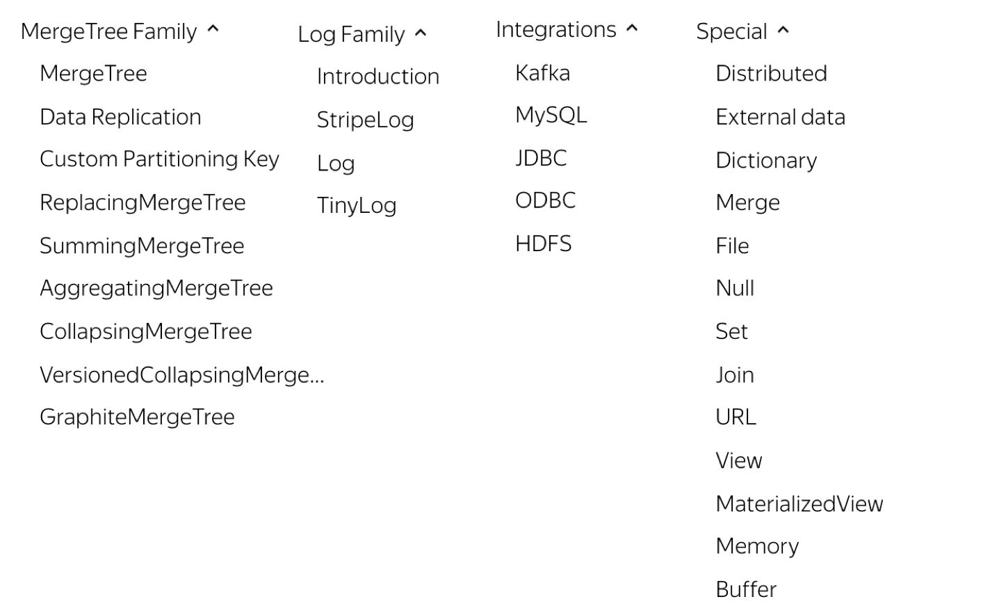

> clickhouse引擎一共分为四个系列，分别是Log、MergeTree、Integration、Special。其中包含两种特殊的表引擎Replicated、Distributed，功能上与其他表引擎正交。

### 引擎

**Log系列**

引擎功能相对简单，主要用于快速写入小表(1百万行左右的表)，然后全部读出的场景。

**Integration系列**

引擎主要用于把外部数据导入到ClickHouse中，或者在Clickhouse中直接操作外部数据源。

**Special系列**

引擎主要为了特定场景定制。

**MergeTree系列**

MergeTree：

引擎主要用于海量数据分析，支持数据分区、存储有序、主键索引、稀疏索引、数据TTL等。MergeTree支持所有Clickhouse sql语法，但是有些功能与MySQL并不一致，比如MergeTree主键不去重。

由于MergeTree采用类似LSM tree的结构，很多存储层处理逻辑直到Compaction期间才会发生。

MergeTree虽然有主键索引，但是主要作用是加速，而不是为了保持唯一。Compaction完成后还是有主键相同数据。

ReplicatedMergeTree: 多副本多分片

### 参考

engine:https://developer.aliyun.com/article/762461

lsm-tree:https://cloud.tencent.com/developer/article/1441835
