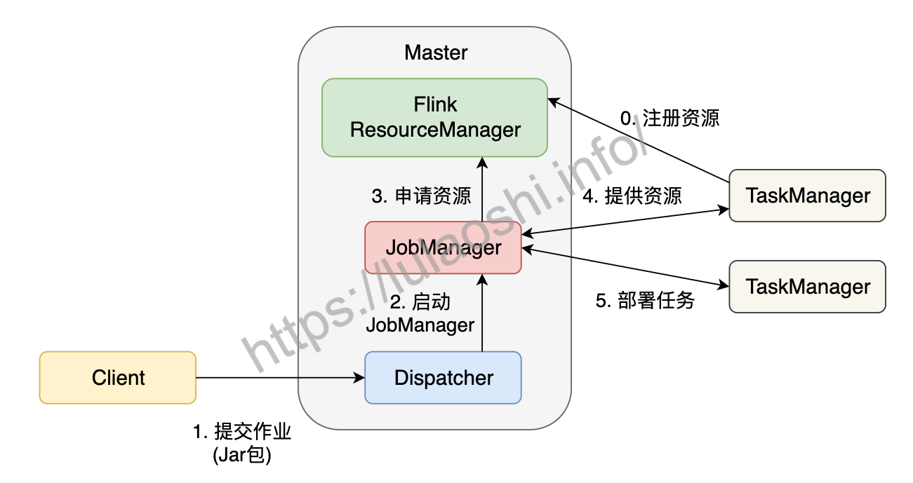

> Flink作业提交过程

<!-- more -->

### Flink作业提交过程

Master和TaskManager在作业提交前启动(bin/start-cluster.sh)，TaskManager将自己注册给Master中的ResourceManager，初始化和资源注册过程发生在作业提交前，称之为第0步。

1.用户通过Flink客户端Clien提交作业，调用API构建数据流图，代码和配置编译打包，提交Master的Dispatcher，形成一个应用Application；

2.Dispatcher接收作业，启动JobManager，负责本次作业的各项协调工作；

3.JobManager向ResourceManager申请本次作业所需资源；

4.闲置TaskManager会被反馈给JobManager；

5.JobManager将逻辑视图转化为并行的物理执行图，将计算任务分发部署到多个TaskManager上，任务开始执行；
