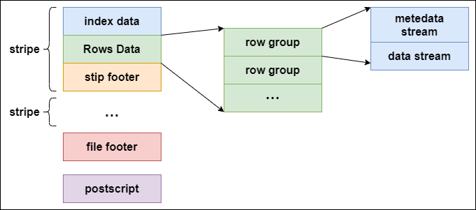
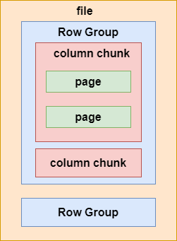

> Hive存储数据格式对比

<!-- more -->

## Hive存储

### 概览

* 行式存储
  * 文本格式（TextFile）
  * 二进制序列化文件（SequenceFile）

* 列式存储
  * 行列式文件（RCFile）
  * 优化的行列式文件（ORCFile）
  * Parquet

### 列式存储优势

  - 查询时只读指定列，查询速度快
  - 压缩时相同数据类型，压缩比高

### 典型分析

#### TextFile

TextFile直接行式存储，可以直接load方式加载数据，加载速度快；

TextFile反序列化必须逐个字符判断是不是分隔符或行结束符号，开销大；

#### ORCFile

* 1.ORC扩展了RCFile的压缩，除了**游程编码**(run-length)，引入**字典编码**和**BIT编码**；

* 2.每个TASK只输出单个文件，减少NameNode负载；

* 3.支持复杂数据类型，datetime、decimal、struct、list、map等；

* 4.文件可切分，查询时输入数据量少；

> 游程编码：变动长度编码法，AAAABBBCCDEEEE->4A3B2C1D4E;
>
> 字典编码：最后存储字典值，每个字典值长度以及字段在字典位置；
>
> BIT编码：null则存0否则1，null实际编码不需要存储，不占用存储空间；

结构： 

  每个ORC文件横向切分多个stripe，每个stripe列式存储，每个stripe默认250MB；

* 条带(stripe)：ORC文件存储数据；
* 文件注脚(file footer)：包含了文件中stripe的列表，每个stripe的行数，以及每个列的数据类型；每个列的最小值，最大值，行计数，求和等聚合信息。
* postscript：含有压缩参数和压缩大小相关信息。

stripe：

* Index data：条带统计信息，数据在条带中位置索引信息。
* rows data：数据存储，多个**行组**组成，数据以流(stream)形式存储。
* stripe footer：保存数据所在文件目录。

rows data存储两部分数据，metadata stream和data stream：

* metadata stream：描述每个行组的元数据信息；
* data stream：存储数据；

ORC三级索引：

* 文件级：记录文件中所有stripe的位置信息，以及文件中所存储的每列数据的统计信息；
* 条带级：记录每个stripe所存储数据的统计信息；
* 行组级：记录每个行组所存储数据的统计信息，在stripe中，10000行构成一个行组；

三级索引查找过程：

  查询ORC文件类型的表时，会先对比文件级索引列统计信息，找到满足条件的文件；接着，根据条带级索引信息，找到满足条件的条带快，之后在根据行组级索引，找到满足条件的行组；避免遍历全部，减少磁盘和网络I/O。

数据类型（所有类型都接受NULL值）：

* 整型：包含boolean(1 bit)、tiny(8 bit)、smallint(16 bit)、int(32 bit)、bigint(64 bit)
* 浮点型：包含float和double
* 字符串类型：包含string、char和varchar
* 二进制类型：包含binary
* 日期和时间类型：包含timestamp和date
* 复杂类型：包含struct、list、map和union类型

ACID事务支持：

  Hive 0.14版本之前，只能新增或者删除整块分区或表，而不能对表的单个记录进行修改；

  Hive 0.14版本之后，ORC文件能够保证原子性、一致性、隔离性和持久性的ACID事务能够被支持，支持数据更新；

  Hive事务适用于大批量数据更新，不建议频繁小批量更新；

压缩：

  可选的类型有 NONE、ZLIB 和 SNAPPY，默认值是 ZLIB

#### Parquet

结构：

  Parquet存储数据时，同时存储多级元数据，文件级元数据、列块级元数据、页级元数据；

* 文件级元数据：表结构信息；文件记录数；行组数、每个行组数据总量和记录数；每个行组列块的文件偏移量；

* 列块级元数据：压缩前后数据大小和压缩编码；数据页、索引页的偏移量；列块的数据记录数；

* 页级元数据：编码信息和数据记录数；

Parquet针对嵌套式结构支持好，ORC多层嵌套表达起来比较复杂，性能损失大；

参考：

https://blog.51cto.com/u_14932245/4608206
