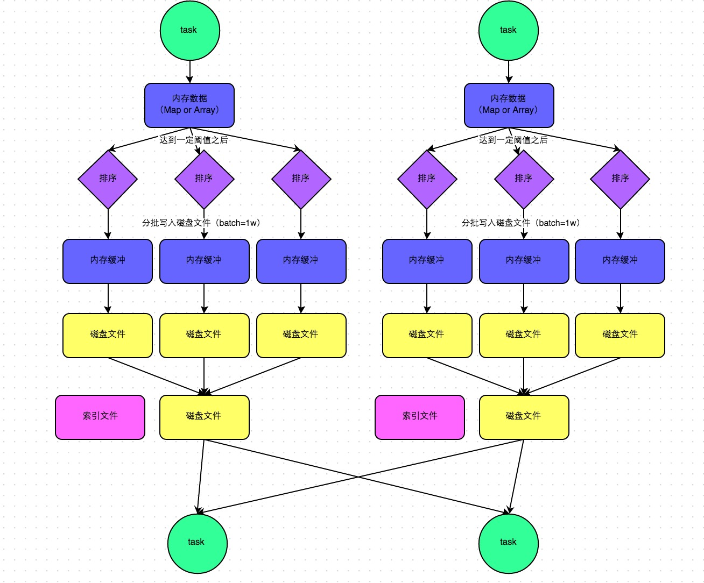

> Spark汇总

<!-- more -->

### Spark优化原则

#### 原则1:避免创建重复的RDD

#### 原则2:尽可能复用同一个RDD

#### 原则3:对多次使用的RDD进行持久化

cache() 使用**非序列化**的方法将RDD中的数据全部尝试持久化到内存中；

persist() 选择持久化级别、方式进行持久化。_SER后缀表示序列化后保存，每个Partition会被序列化一个大的字节数组，然后持久化到内存或磁盘，减少数据占用内存过多，避免频繁GC；

| 级别                | 含义                                                         |
| ------------------- | ------------------------------------------------------------ |
| MEMORY_ONLY         | 默认，放内存，同cache()，内存不够就不持久化，算子操作时候从源头计算一遍； |
| MEMORY_AND_RISK     | 内存不够放磁盘，算子操作时从磁盘中取出来用；                 |
| MEMORY_ONLY_SER     | 同MEMORY_ONLY，区别是序列化，节省内存避免频繁GC；            |
| MEMORY_AND_DISK_SER | 同MEMORY_ONLY_SER，区别是序列化，节省内存避免频繁GC；        |
| DISK_ONLY           | 放磁盘；                                                     |
| *_2                 | 上面的所有策略+_2后缀表示每个持久化数据都有副本放其他节点，容灾； |

#### 原则4:尽量避免使用shuffle类算子

shuffle解释：将分布在集群多个节点上的同一个key，拉取到同一个节点上，进行聚合或join等操作，比如，reduceByKey、join、distinct、repartition等，应该尽量使用map类操作替代;

shuffle过程：各个节点相同key都会先写磁盘，其他节点通过网络传输拉取各个节点磁盘文件中相同key，节点内存不够溢写磁盘，大量的磁盘IO和网络传输导致shuffle性能较差；

```scala
// broadcast+map替代join
val rdd3 = rdd1.join(rdd2)
// broadcast+map不会产生shuffle 适用于rdd2数据量较少 <2G 
val rdd2Data = rdd2.collect()
val rdd2DataBroadcast = sc.broadcast(rdd2Data) // 每个Executer都有一份rdd2了
val rdd3 = rdd1.map(rdd2DataBroadcast...)// 找到相同key然后处理
```

#### 原则5:使用map-side预聚合的shuffle操作

#### 原则6:使用高性能算子

groupByKey是直接shuffle，reduceByKey和aggregateByKey先预聚合再shuffle，区别是后者可以指定初始值并且partition内部和之间的聚合操作可以不同，如果相同可以用foldByKey，

```scala
object AggByKeyOpt {
  def main(args: Array[String]): Unit = {
    val sparkConf = new SparkConf().setAppName("test").setMaster("local")
    val sc = new SparkContext(sparkConf)
    val data = Seq((1,3),(1,2),(1,4),(2,3))
    val rdd = sc.parallelize(data, 2)
    //合并不同partition中的值，a，b得数据类型为zeroValue的数据类型
    def combOp(a:String,b:String):String={
      println("combOp: "+a+"\t"+b)
      a+b
    }
    //合并在同一个partition中的值，a的数据类型为zeroValue的数据类型，b的数据类型为原value的数据类型
    def seqOp(a:String,b:Int):String={
      println("SeqOp:"+a+"\t"+b)
      a+b
    }
    rdd.foreach(println)
    val aggregateByKeyRDD=rdd.aggregateByKey("100")(seqOp, combOp)
    aggregateByKeyRDD.foreach(println)
    sc.stop()
  }
}
```

mapPartitions代替map，一次函数调用处理一个partition而非单条，容易OOM，如果内存不够垃圾回收无法回收太多对象；

foreachPartitions代替foreach，对于每个partition如果连接mysql连接一次就可以；

filter之后使用coaleasce操作，将rdd压缩到更少partition使用更少task处理；

repartitionAndSortWithinPartitions代替repartition与sort操作，shuffle和sort同时进行，性能更高；

#### 原则7:广播大变量

大变量，100M以上，默认情况下会复制多份传输到task中，大量变量副本消耗网络传输，在各个节点Executor中占用过多内存频繁GC，广播的话，每个Executor只保留一份副本，Executor中的task共用；

```scala
val list1 = ...
val list1Broadcast = sc.broadcast(list1)
rdd1.map(list1Broadcast...)
```

#### 原则8 使用Kryo优化序列化性能

Spark中三个地方涉及到了序列化：

* 算子函数使用外部变量时，变量会被序列化后进行网络传输；
* 自定义类型作为RDD的范型时，会进行序列化，要求自定义类实现Serializable接口；
* 使用可序列化的持久化策略时，例如MEMORY_ONLY_SER；

Spark默认使用Java序列化机制，ObjectOutputStream/ObjectInputStream API进行序列化和反序列化，使用Kryo性能提高10倍；

```scala
// 创建SparkConf对象。
val conf = new SparkConf().setMaster(...).setAppName(...)
// 设置序列化器为KryoSerializer。
conf.set("spark.serializer", "org.apache.spark.serializer.KryoSerializer")
// 注册要序列化的自定义类型。
conf.registerKryoClasses(Array(classOf[MyClass1], classOf[MyClass2]))
```

#### 原则9:优化数据结构

三种数据类型比较耗费内存:1)对象，每个Java对象都有对象头、引用等额外信息，比较占用内存；2)字符串，每个字符串内部都有一个字符数组以及长度等信息；3）集合类型，比如HashMap、LinkedList等，因为集合类型内部通常会使用一些内部类来封装集合元素，比如Map.Entry；

官方建议，使用原始类型比如Int、long代替字符串，数组代替集合类型，减少内存占用，降低GC频率，提升性能；

### Spark作业基本运行原理


spark-submit提交Spark作业，启动一个对应Driver进程，根据部署模式不同，本地启动或者集群某个工作节点启动。Driver会占用一定数量的内存和CPU core。Driver进程首先向资源管理集群(Yarn等)申请资源，资源指的是Executor进行，资源管理集群会根据资源参数，在各个工作节点上启动一定数量的Executor进程，每个Executor进程会占用一定数量的内存和CPU core；

资源到位，Driver开始将Spark作业拆分多个stage，并为每个stage创建一批task，然后将task分配到Executor执行，task是最小的计算单元，负责执行一摸一样的计算逻辑(代码片段)，stage的所有task执行完毕之后，中间结果写入本地磁盘，Driver开始调度运行下一个stage，输入数据是上一个stage中间结果，直到全部执行；

Spark根据shuffle类算子进行stage划分，每个stage会通过网络传输拉取需要自己处理的所有相同key，然后进行聚合操作，这就是shuffle；

cache/persist会把task计算出来的数据保存到Executor进程的内存或者所在节点的磁盘文件中；

Executor内存模型：20%执行task逻辑，20%执行shuffle操作，60%执行RDD持久化，详见参考(3)；

task执行速度和CPU core直接相关，task执行独占CPU core；

#### num-executors

Spark作业总共要用多少Executor进程执行，太少无法充分利用集群资源，太多队列无法给予，一般50-100；

#### executor-memory

Executor内存大小决定Spark作业性能，太小容易OOM，一般4G-8G；

#### executor-cores

每个Executor进程的CPU core数量，越多执行越快，一般2-4；

#### driver-memory

设置Driver进程内存，如果使用collect算子会将RDD数据拉到Driver上进行处理需要更多内存否则OOM，否则，一般1G；

#### spark.default.parallelism

每个stage默认task数量，默认是根据底层HDFS block(hadoop2.x是128M)数量，通常默认很少(几十)，官网建议num-executors*executor-cores的2-3倍，一般500-1000；

#### spark.storage.memoryFraction

RDD持久化数据在Executor内存占比，默认0.6，如果内存不够就写磁盘，持久化操作多就提高，shuffle类操作多就降低，频繁GC说明执行task逻辑内存不够也降低(通过spark web ui查看gc耗时)；

#### spark.shuffle.memoryFraction

shuffle过程中拉到上个stage输出后，进行聚。合操作能使用的Executor内存比例，默认0.2，超过溢写磁盘，降低性能。如果RDD持久化操作少，shuffle操作多建议提高，如果作业频繁GC导致运行缓慢，意味着task逻辑执行内存不够，建议降低；

```bash
# 示例
./bin/spark-submit \
  --master yarn-cluster \
  --num-executors 100 \
  --executor-memory 6G \
  --executor-cores 4 \
  --driver-memory 1G \
  --conf spark.default.parallelism=1000 \
  --conf spark.storage.memoryFraction=0.5 \
  --conf spark.shuffle.memoryFraction=0.3 \
```

### Spark数据倾斜处理

#### 现象

1）个别task执行慢

2）突然OOM异常

#### 原理

进行shuffle时候，某个key对应数据量特别大，spark运行进度是由运行时间最长的task决定；

#### 定位

可能触发shuffle操作算子：distinct、groupByKey、reduceByKey、aggregateByKey、join、cogroup(对两个RDD中的KV元素,每个RDD中相同key中的元素分别聚合成一个集合)、repartition等；

Spark Web UI查看stage各个task分配的数据量、运行时间；

推算stage与代码关系：shuffle类算子前后会分两个stage，如下，reduceByKey前后会划分两个stage，stage0执行textFile到map以及shuffle write操作，每个task处理的数据中，相同key会写入同一个磁盘文件；stage1执行reduceByKey到collect操作，首先执行shuffle read操作，会从stage0各个task所在节点拉取需要key，然后对相同key进行聚合或者join操作，在这里是对相同key的value累加，最后执行collect算子，将所有数据拉到Driver上打印输出；

查看key分布：直接通过sparksql查看key分布，如果是RDD文件可以通过RDD.countByKey()之后collect/take打印；

```scala
// 单词计数
val conf = new SparkConf()
val sc = new SparkContext(conf)
val lines = sc.textFile("hdfs://...")
val words = lines.flatMap(_.split(" "))
val pairs = words.map((_,1))
val wordCounts = pairs.reduceByKey(_ + _) // 
wordCounts.collect().foreach(println(_))
```

#### 解决方案1：使用Hive ETL预处理数据

预先聚合或join，将数据倾斜发生提前，减少spark shuffle时间，治标不治本，还是会发生倾斜；

#### 解决方案2：过滤少数导致倾斜的key

#### 解决方案3：提高shuffle操作的并行度

reduceByKey(1000)，增加shuffle read task并行度，spark.sql.shuffle.partitions就代表该并行度，默认值200，200个task不够，会导致单task分配过多数据，增多可以减少单task执行时间(原来单task分配5个key，增加之后只分1个key)。实现简单，但是效果有限，因为如果单key对应数据太多没法再分；

#### 解决方案4：两阶段聚合(局部聚合+全局聚合)

首先局部聚合，key+随机前缀，然后执行reduceByKey等操作，之后去掉key随机前缀，在进行全局聚合，得到最终结果；适用于聚合类shuffle操作，不适用于join类shuffle操作；

#### 解决方案5：将reduce join转为map join

适用于join类操作时其中一个RDD或表较小(<2G)，使用broadcast变量完全规避shuffle，使用map进行连接；将较小的RDD直接通过collect算子拉取到Driver端内存再分发到Executor；

```java
List<Tuple2<Long, Row>> rdd1Data = rdd1.collect();
final Broadcast<List<Tuple2<Long, Row>>> rdd1DataBroadcast = sc.broadcast(rdd1Data); // 广播
JavaPairRDD<String,Tuple2<String,Row>> joinedRdd = rdd2.mapToPair(
	new PairFunction<Tuple2<Long,String>,String,Tuple2<String,Row>>(){
    private static final long serialVersionUID = 1L;
    @override
    public Tuple2<String, Tuple2<String, Row>> call(Tuple2<Long, String> tuple) throw Exception{
      List<Tuple2<Long, Row>> rdd1Data = rdd1DataBroadcast.value(); // 获取广播变量
      Map<Long, Row> rdd1DataMap = new HashMap<Long, Row>(); // 广播变量转化为Map
      for(Tuple2<Long, Row> data: rdd1Data){
        rdd1DataMap.put(data._1, data._2);
      }
      // 获取当前rdd的key和value
      String key = tuple._1;
      String value = tuple._2;
      Row rdd1Value = rdd1DataMap.get(key); // 获取join到数据
      return new Tuple2<String, String>(key, new Tuple2<String, Row>(value, rdd1Value));
    }
  }
)
```

#### 解决方案6：采样倾斜key并分拆join操作

左表/RDD少数key数量大右表/RDD分布均匀时，左边sample算子采样出数量大的n个key，然后将拆分，加上n以内随机数前缀，右边也过滤出这些key也加上n以内前缀膨胀n倍，左右拆分出来的做join，未拆分出来的也做join，然后union结果，就是最终的结果；适用于倾斜key少的时候；

#### 解决方案7：随机前缀和扩容RDD进行join

适用于在join操作时，RDD中有大量key导致数据倾斜，分拆没意义，左边所有都加n以内随机前缀，右边稳定扩容n倍，然后左右join；

#### 解决方案8：多种方案组合使用

针对复杂场景，需要多种方案组合使用，针对多环节数据倾斜spark作业，可以先预处理，其次可以shuffle操作提高并行度，最后针对不同的聚合或join操作，才用两段聚合、随机前缀等方案；

### Shuffle调优

#### HashShuffleManager运行原理

假设前提：每个Executor只分配1个CPU core，也就是说无论这个Executor上分配多少个task线程，同一时间只能执行一个task线程；

##### 未经优化的HashShuffleManager

shuffle write：当前stage的每个task要为下个stage创建多少份磁盘文件？下个stage有多少task就要创建多少！下个stage有100个task，当前stage的每个task就要创建100份磁盘文件。如果当前stage有50个task，总共有10个Executor，那么每个Executor执行5个task，每个Executor会创建500个磁盘文件；

shuffle read：通常是一个stage刚开始要做的事，该stage中的每个task从上个stage拉取相同key，网络传输到自己所在节点，然后聚合或连接；此时上个stage中的task已经分好了给下个stage每个task的磁盘文件，直接拉取；

shuffle read的拉取过程是一边拉取一边聚合的，每个shuffle read task都有自己的buffer缓冲，每次都只能拉取与buffer缓冲相同大小的数据，然后通过内存中的Map进行聚合等操作，聚合完一批再拉下一批；


##### 优化后的HashShuffleManager

设置参数spark.shuffle.consolidateFiles=true，默认是false。出现shuffleFileGroup概念，CPU core决定可以并行task数量，每个Executor上磁盘文件数此时取决于CPU core数量*stage的task数量，consolidate机制使不同task可以复用同一批磁盘文件。减少磁盘文件数量，提升shuffle write性能；


#### SortShuffleManager运行原理

SortShuffleManager分为普通运行机制和bypass运行机制，当shuffle read task的数量小于等于spark.shuffle.sort.bypassMergeThreshold参数值时(默认200)，就启用bypass机制；

##### 普通运行机制

排序之后分批(1万条)溢写磁盘，写入磁盘是通过java的BufferedOutputStream实现，先缓冲内存，内存满了之后溢写磁盘，每个task最终只有一个磁盘文件，但是会有一个索引文件，标识下游各个task需要数据的start offset和end offset；



##### bypass运行机制

触发条件：shuffle map task数量小于spark.shuffle.sort.bypassMergeThreshold参数的值，不是聚合类的shuffle算子(例如reduceByKey)；

此时task会为每个下游task通过hash创建一个临时磁盘文件，类似于HashShuffleManager未优化版本，但是最终会做一个磁盘文件的合并，所以相对来说shuffle read性能会好些；

相较于SortShuffleManager普通机制，磁盘写机制不同，不会进行排序；


#### spark.shuffle.file.buffer

默认值：32k

参数说明：设置shuffle write task的BufferedOutputStream的buffer缓冲大小，将数据写到磁盘文件之前，会先写到buffer缓冲中，待缓冲写满之后，才会溢写磁盘；

调优建议：如果作业可用的内存资源较为充足的话，可以适当增加这个参数的大小(比如64k)，从而减少shuffle write过程中溢写磁盘文件的次数，也就可以减少磁盘IO次数，进而提升性能。合理调节，1%-5%性能提升；

#### spark.reducer.maxSizeInFlight

默认值：48M

参数说明：该参数用于设置shuffle read task的buffer缓冲大小，这个buffer缓冲决定了每次拉取多少数据

调优建议：如果作业可用的内存资源较为充足的话，可以适当增加这个参数的大小(比如96m)，从而减少拉取数据的次数，也就可以减少网络传输的次数，进而提升性能。合理调节，1%-5%性能提升；

 #### spark.shuffle.io.maxRetries

默认值：3

参数说明：shuffle read task从shuffle write task所在节点拉取自己的数据时，如果因为网络异常导致拉取失败，是会自动进行重试的。该参数代表可以重试的最大次数，如果在指定次数之内拉取还没成功，就可能导致作业执行失败。

调优建议：对于那些包含特别耗时的shuffle操作作业，建议增加重试最大次数(比如60次)，以避免JVM的full gc或者网络不稳定等因素导致数据拉取失败。对于超大数据量(数十亿-上百亿)的shuffle过程，调节该参数可以大幅度提升稳定性；

 #### spark.shuffle.io.retryWait

默认值：5s

参数说明：代表每次重试拉取数据的等待间隔，默认是5s。

调优建议：建议加大间隔时长，以增加shuffle操作的稳定性。

#### spark.shuffle.memoryFraction

默认值：0.2

参数说明：该参数代表Executor内存中，分配给shuffle read task进行聚合操作的内存比例，默认是20%。

调优建议：如果内存充足，而且很少使用持久化操作，建议提高这个比例，给shuffle read的聚合操作更多内存，以避免由于内存不足聚合过程中频繁读写磁盘。实践过程中，合理调节，10%性能提升；

 #### spark.shuffle.manager

默认值：sort

参数说明：该参数用于设置ShuffleManager的类型。Spark1.5之后，有三个可选项：hash、sort和tungsten-sort。HashShuffleManager是Spark1.2之前的默认选项，但是spark 1.2之后版本默认都是SortShuffleManager了。tungsten-sort与sort类似，但是使用了tungsten计划中的堆外内存管理机制，内存使用效率更高；

调优建议：SortShuffleManager默认会对数据进行排序，如果业务逻辑需要该排序机制的话，则使用默认的SortShuffleManager就可以，如果不需要对数据进行排序，通过bypass机制或优化的HashShuffleManager来避免排序操作，同时提供较好的磁盘读写性能。tungsten-sort慎用～

#### spark.shuffle.sort.bypassMergeThreshold

默认值：200

参数说明：当ShuffleManager为SortShuffleManager时，如果shuffle read task的数量小于这个阈值时，则shuffle write不会进行排序操作，而是按照未经优化的HashShuffleManager的方式写数据，最后会将每个task产生的所有临时磁盘文件都合并成一个文件，并会创建单独的索引文件；

调优建议：当使用SortShuffleManager时，如果的确不需要排序操作，调大参数，大于shuffle read task的数量，会自动启用bypass机制，map-side就不会进行排序了，减少了排序性能开销，但是依然会产生大量磁盘文件，因此shuffle write性能有待提高；

 #### spark.shuffle.consolidateFiles

默认值：false

参数说明：如果使用了HashShuffleManager，该参数有效，如果设置了true，那么就会开启consolidate机制，会大幅度合并shuffle write的输出文件，对于shuffle read task数量特别多的情况下，这种方法可以极大减少磁盘IO开销，提升性能；

调优建议：如果的确不需要SortShuffleManager排序机制，除了使用bypass还可以将spark.shuffle.manager设置为hash，使用HashShuffleManager，同时开启consolidate机制。实践表示，性能比开启bypass的SortShuffleManager要高出10%-30%；

### 参考

(1)https://tech.meituan.com/2016/04/29/spark-tuning-basic.html

(2)https://tech.meituan.com/2016/05/12/spark-tuning-pro.html

(3)https://bbs.huaweicloud.com/blogs/325349
