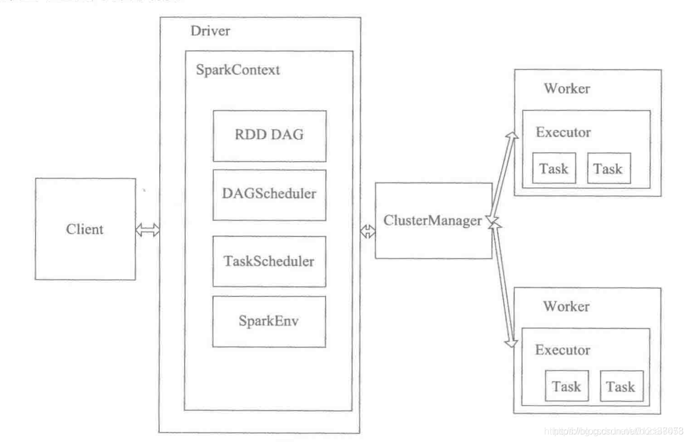

> Spark角色

<!-- more -->

| 角色名称        | 解释                                                         |
| --------------- | ------------------------------------------------------------ |
| Master          | 常驻master守护进程，负责管理worker节点，从master节点提交应用 |
| Worker          | 常驻worker守护进程，与master节点通信，并且管理executor进程，运行一个或多个Executor进程，相当于计算节点 |
| Client          | 用户提交作业的客户端                                         |
| Driver          | 负责控制一个应用的执行，运行Application的main函数和初始化SparkContext，Driver将Task和Task所依赖的file和jar(序列化后)传递给对应的Worker机器执行 |
| Executor        | executor进程宿主在worker节点上，一个worker可以有多个executor，每个executor持有一个线程池，每个线程可以执行一个task，executor执行完task以后将结果返回driver，每个executor执行的task都属于同一个应用。此外executor还有一个功能就是为应用程序中要求缓存的RDD提供内存式存储，RDD是直接缓存在executor进程内的，因此任务可以运行时充分利用缓存加速运算。一个container对应一个JVM进程(也就是一个executor) |
| Job             | action的触发会生成一个job，job会提交给DAGScheduler，分解成Stage |
| Stage           | DAGscheduler根据shuffle将job划分为不同的stage，同一个stage包含多个task，这些task有相同shuffle dependencies |
| Task            | 被送到executor上的工作单元，task简单来说就是在一个数据partition上单个数据处理流程 |
| Cluster Manager | 在集群上获取资源的外部服务(例如：Standalone、Mesos、Yarn)    |
| SparkContext    | 整个应用的上下文，控制程序的生命周期                         |
| DAGScheduler    | 根据Job构建基于Stage的DAG工作流，并提交Stage给TaskScheduler  |
| TaskScheduler   | 将task发给Executor执行                                       |
| SparkEnv        | 线程级别的上下文，存储运行时的重要组件的引用                 |

