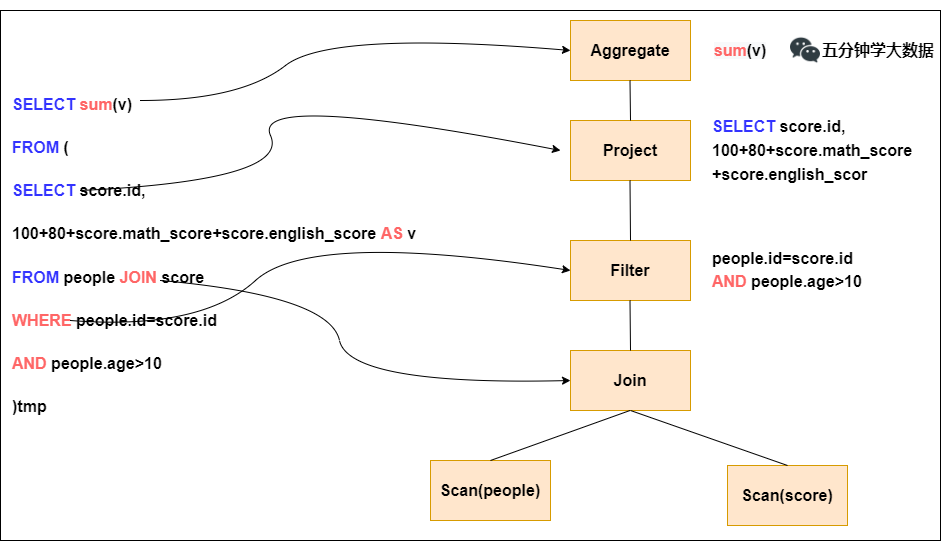
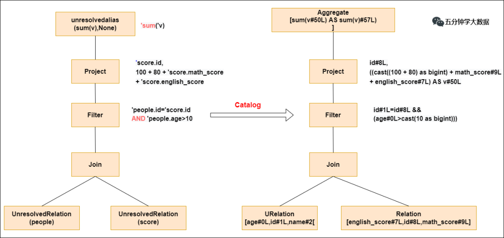
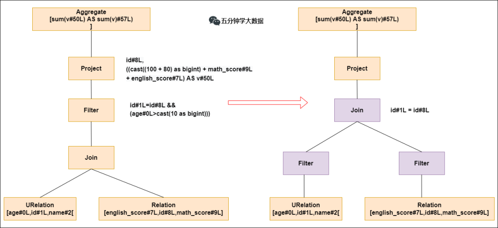
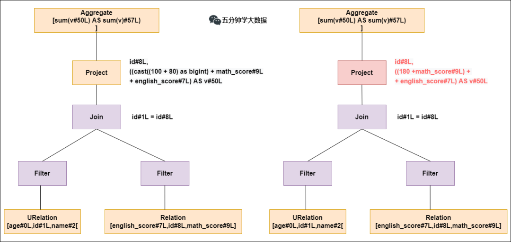
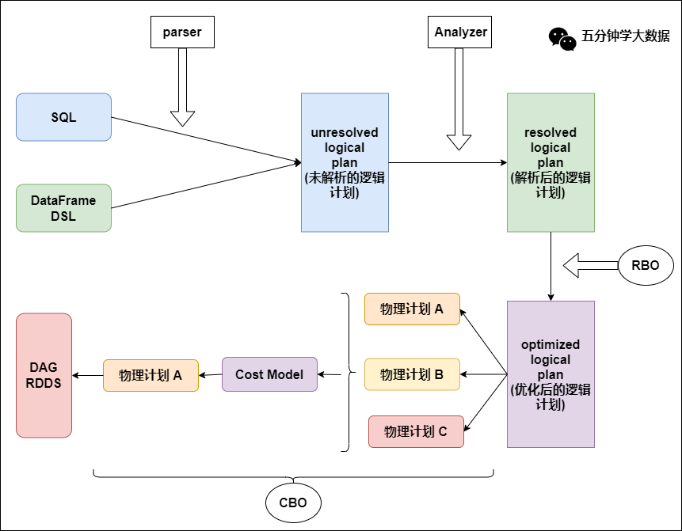

> Spark SQL执行原理

<!-- more -->

### 原理

#### 了解Catalyst

  Spark SQL核心：

* 解析(Parser)
* 优化(Optimizer)
* 执行(Execution)

  五大组件：

* Parser模块：将sql解析为抽象语法树(AST)

  依赖第三方类库ANTLR

  

* Analyzer模块：遍历AST，对AST节点数据类型和函数绑定，根据元数据信息Catalog解析数据表字段

  会判断表名、字段名是否存在

  

* Optimizer模块：Catalyst核心，RBO(基于规则优化)和CBO(基于代价优化)

  谓词下推：过滤操作下推join之前，减少join数据量，减少耗时；

  

  常量累加：减少每行重复常量计算，直接使用结果；

  

  列值裁剪：裁剪不需要的列，减少网络、内存消耗，提高列式存储扫描效率；

* SparkPlanner模块：优化后的逻辑执行计划(OptimizedLogicalPlan)转为物理计划PhysicalPlan

  例如，Spark会针对join算子制定真正执行的计划：

  * BroadcastHashJoin(小join大)：

    小表分发到大表所在节点，广播算法可以是先发给driver然后分发给executor，在executor执行小表映射，大表试探；

    SparkSQL规定BroadcastHashJoin执行条件，小表小于参数spark.sql.autoBroadcastJoinThreshold，默认10MB；

  * ShuffleHashJoin(大join小)

    两张表中的数据充分布到集群所有节点，称为shuffle，节点上执行hash join算法；

  * SortMergeJoin(大join大)

    先shuffle，节点上两表sort，双指针遍历，匹配merge

  > hash join：
  >
  > 1）确定build table和probe table，通常build小probe大
  >
  > 2）build table根据key做hash，生成hash table缓存到内存，内存不够dump外存
  >
  > 3）扫描probe table相同hash映射，匹配则join到一起 

* CostModel模块：根据性能统计数据，选择最佳物理执行计划，基于CBO

  选择代价最小的物理执行计划

### 总结

 * 选择最优物理执行计划，生成java字节码，将SQL转化为DAG，以RDD形式进行执行；

   

### 参考

https://cloud.tencent.com/developer/article/2008340

https://blog.csdn.net/lp284558195/article/details/80717219
