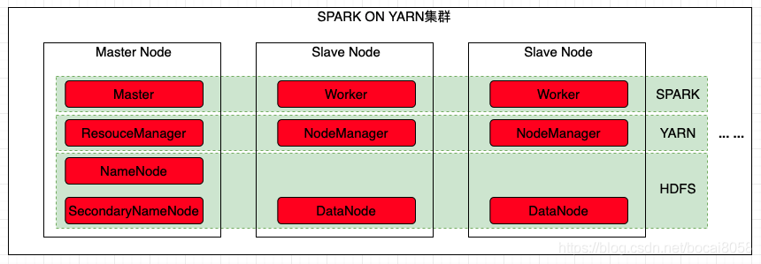
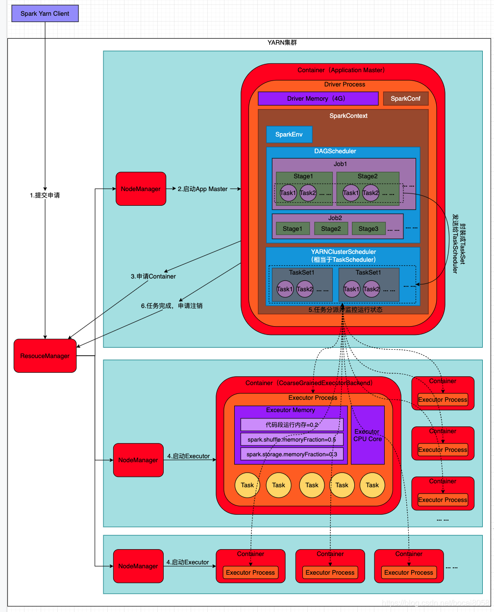
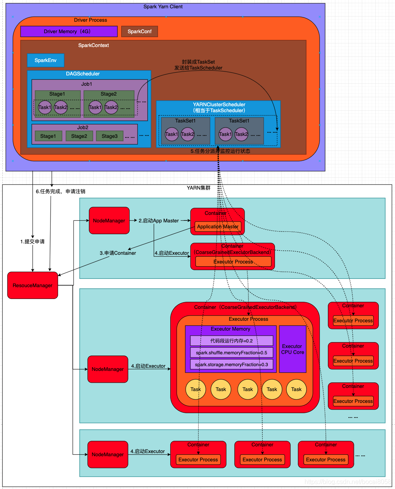

> Spark on Yarn执行流程

<!-- more -->

SparkOnYarn集群，以HDFS为文件系统，以Yarn为资源管理和资源分配建立Spark集群，集群3个节点，1个master节点，2个slave节点

### Yarn-Cluster模式

> 1.第一阶段：Spark的**Driver作为一个ApplicationMaster**在Yarn集群中启动
>
> 2.第二阶段：ApplicationMaster创建应用程序，然后为它向ResourceManager申请资源，并启动Executor来运行Task，同时监控运行过程，直到运行完成

流程说明：

* Spark Yarn Client向Yarn提交应用程序，包括ApplicationMaster程序、启动ApplicationMaster的命令、需要在Executor中运行的程序等；
* ResourceManager收到请求后，在集群中选择一个NodeManager，为该应用程序分配第一个Container，要求它在这个Container中启动应用程序的ApplicationMaster，启动ApplicationMaster进行SparkContext等的初始化；
* ApplicationMaster向ResourceManager注册，这样用户可以直接通过ResourceManager查看应用程序运行状态，然后它将采用轮训的方式通过RPC协议为各个任务申请资源，并监控它们的运行状态直到运行结束；
* 一旦ApplicationMaster申请到资源(也就是Container)后，便与对应的NodeManager通信，要求它在获得的Container中启动CoarseGrainedExecutorBackend，CoarseGrainedExecutorBackend启动后会向ApplicationMaster中的SparkContext注册并申请Task。这点同Standalone，但是SparkContext在Spark Application中初始化时，使用CoarseGrainedSchedulerBackend配合YarnClusterScheduler进行任务的调度，其中YarnClusterScheduler只是对TaskSchedulerImpl的一个简单包装，增加了对Executor的等待逻辑；
* ApplicationMaster中的SparkContext分配给Task给CoarseGrainedExecutorBackend执行，CoarseGrainedExecutorBackend运行Task并向ApplicationMaster汇报运行时的状态和进度，以让ApplicationMaster随时掌握各个任务的运行状态，从而可以在任务失败时重启；
* 应用程序运行结束，ApplicationMaster向ResourceManager申请注销和关闭

### Yarn-Client模式

* Spark Yarn Client向Yarn的ResourceManager申请启动Application Master。同时在SparkContext初始化中将创建DAGScheduler和TaskScheduler、SparkEnv对象等，由于选择的是Yarn-Client模式，程序会选择YarnClientScheduler和YarnClientSchedulerBackend；
* ResourceManager收到请求后，会在集群在选择一个NodeManager，为该程序分配第一个Container，要求它在这个Container中启动应用程序的ApplicationMaster，与Yarn-Cluser区别在于ApplicationMaster不运行SparkContext，只与SparkContext进行联系资源的分派；
* Client的SparkContext初始化完毕后，与ApplicationMaster建立通讯，向ResourceManager注册，根据任务信息向ResourceManager申请资源；
* 一旦ApplicationMaster申请到资源(也就是Container)后，便与对应的NodeManager通信，要求它在获得Container中启动CoarseGrainedExecutorBackend，CoarseGrainedExecutorBackend启动后会向client中的SparkContext注册并申请Task；
* Client的SparkContext分配Task给CoarseGrainedExecutorBackend执行，CoarseGrainedExecutorBackend运行Task并向Driver汇报运行的状态和进度，让Client随时掌握各个任务的运行状态，从而在任务失败时重新启动任务；
* 应用程序运行完成后，Client的SparkContext向ResourceManager申请注销和关闭；

### 两者区别

在Yarn中，每个Application实例都有一个ApplicationMaster进程，它是Application启动的第一个容器。它负责和ResourceManager打交道并请求资源，获取资源之后告诉NodeManager为其启动Container；

| 比较项             | YARN-Client模式                                              | YARN-Cluster模式                                             |
| ------------------ | ------------------------------------------------------------ | ------------------------------------------------------------ |
| Application Master | Application Master仅仅向Yarn请求Executor，Client会和请求的Container通信来调度它们工作； | Driver运行在AM(Application Master)中，它负责向YARN申请资源，并监督作业的运行状况。用户提交作业之后，可以关掉Client，作业会继续在YARN运行； |
| Driver             | 运行在Client中                                               | 运行在AM(Application Master)中                               |
| client关闭         | 关闭client，任务就直接结束                                   | 提交任务后可以关闭client，不影响集群程序的运行               |
| 使用场景           | 适合交互和调试环境                                           | 适合生产环境                                                 |
| 监控日志           | 直接查看                                                     | yarn logs -applicationId xxxxxx                              |
| 优点               | 便于调试和查看监控日志                                       | 可以直接关闭client，不影响集群程序的运行                     |
| 缺点               | 1.由于存在大量数据在Driver和集群中进行交互，会在运行过程中产生大量网络数据传输，网络开销加大；2.client关闭，任务结束； | 不便于交互和查看监控日志                                     |

### 参考

sparkhttps://blog.csdn.net/bocai8058/article/details/83051242

shufflehttps://blog.csdn.net/bocai8058/article/details/83051403

yarnhttps://blog.csdn.net/bocai8058/article/details/119300198

算子https://blog.csdn.net/bocai8058/article/details/95651583
